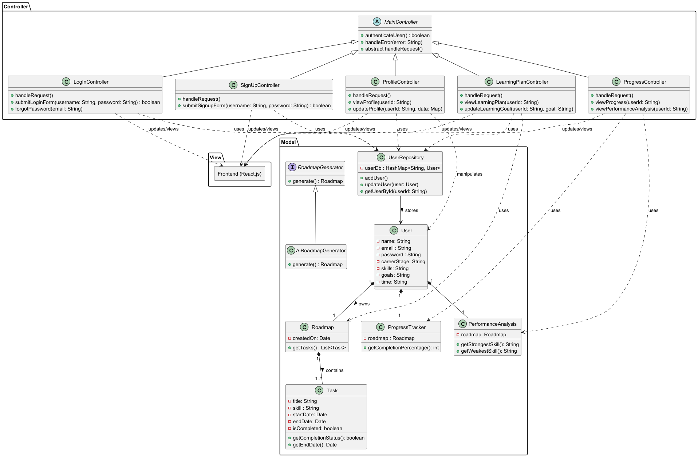

# Proposed tech stacks

Frontend: React.js
Backend: Spring Boot
Database: PostgreSQL

# Problem Statement 

Develop an interactive learning tool specifically designed to empower women in tech by
allowing them to **curate their own learning paths** based on their individual circumstances.
The tool will provide users with hands-on learning experiences to accelerate their learning.

# Features

– Profile Creation: Users can create detailed profiles including their career stage, current
skills, goals, and available time for learning.

– Adaptive learning: This tool aims to generate a personalised learning path for
each user and adjust the content as students progress through their learning.

– Progress Tracking: Tracks the users progress with learning badges and experience levels

– Performance Analysis: Comprehensive tracking and analysis of user performance to
identify strengths and areas for improvement.

# Use Cases

(For all use cases, the System is the application and the Actor is the user, unless stated otherwise)

Use Case: UC1 - Signing in

Main Success Scenario (MSS):
1. User enters username and password into sign in page
2. System brings user to their account page

Use case ends.

Extensions:

- 1a. User does not have an existing account

  - 1a1. System brings user to sign up page

  - 1a2. User creates an account
  
    Use case resumes from step 2.

- 1b. User keys in the wrong password

    - 1b1. System prompts user that password is incorrect

      Use case resumes from step 1.

Use Case: UC2 - Signing up (Creating an account)

MSS:

1. User enters username and password into sign in page
2. User enters password again to confirm password
3. System brings user to their account page

Use case ends.

Extensions:

- 1a. User keys in a weak password

    - 1a1. System prompts user to type in a stronger password

      Use case resumes from step 1.

- 2a. User keys in a password that differs from the original

    - 2a1. System prompts user that password is incorrect

      Use case resumes from step 2.

Use Case: UC3 - Creating a profile 

MSS:

1. In profile page, user can key in their career stage, current skills, goals, and available time for learning.
2. User saves their profile

Use case ends.

Extensions:

- 1a. User keys in a weak password

    - 1a1. System prompts user to type in a stronger password

      Use case resumes from step 1.

- 2a. User keys in a password that differs from the original password

    - 2a1. System prompts the user that their password is incorrect

      Use case resumes from step 2.

Use Case: UC4 - Generating a learning path

MSS:

1. After UC3, user is shown a page containing their personalised learning plan
2. User confirms the learning plan

Use case ends.

Extensions:

- 1a. User wants to edit parts of the plan

    - 1a1. Using the UI, the user makes edits accordingly

      Use case resumes from step 1.

Use Case: UC5 - Progress / Performance Analysis

MSS:

1. User navigates to `Progress` tab
2. User is able to view their strengths and weaknesses
(i.e what they have completed and what they seem to struggle completing) 

Use case ends.

Use Case: UC6 - Tracking of tasks

MSS:

1. After UC4, user can check off tasks they have completed
2. System tracks that the task status has been updated

Use case ends.

Extensions:

- 1a. User incorrectly checks off the wrong task

  - 1a1. User can uncheck the task
  
    Use case resumes from step 2

Use Case: (Nice to have) UC7 - Regeneration of learning plan

MSS:

1. User navigates to `Profile` tab
2. User is able to edit their goals accordingly
3. System regenerates a learning path for them based on their path so far and new goals

Use case ends.

# Implementation

Note: For now, I have included only features that I think are the most necessary.
I would add more features / improve on existing features if time permits!

## Overall structure 

I plan to use the Model-View-Controller (MVC) design pattern, where the `View` aspect is done using React.js
and the `Model` and `Controller` aspect is handled using Spring Boot.

## Features 

### `Profile` tab
This would be a typical profile creation tab with the following fields: career stage, current
skills, goals, and available time for learning. Users would be able to type in their details and they will be
stored as Strings

### `Learning plan` tab
Users will be directed to this tab immediately after creating their profile, where their generated learning path
would be shown.

As the problem statement requires a curated learning path to be created for each user, OpenAI API would be 
prompted with the users details to create a list of actionables (with deadlines to pace the user). 

Example prompt in the backend:

```
You are an expert tech career coach.

Given the following user information:
- Career stage: {{career_stage}}
- Current skills: {{skills}}
- Learning goals: {{goals}}
- Available learning time per week: {{hours}} hours

Generate a personalized learning plan as a list of tasks. Each task should have the following fields:
- title: a clear, concise name of the task
- skill: the primary skill or topic this task focuses on
- start_date: the date the user should start this task (ISO format YYYY-MM-DD)
- end_date: the date the user should complete this task (ISO format YYYY-MM-DD)

Space out tasks realistically according to the user's available learning time per week.

Return the entire response only in JSON format as a list of task objects, like below,
and do not include any additional text:

[
  {
    "title": "string",
    "skill": "string",
    "start_date": "YYYY-MM-DD",
    "end_date": "YYYY-MM-DD"
  }
]
```

This JSON can be deserialised on the backend into Java objects for persistence and serving to frontend.

After the user confirms her learning path, this tab would be in a format similar to a to-do-list to enable users to
check off completed tasks.

### `Progress` tab
Progress Tracking: The number of uncompleted tasks will be reflected, as well as the number of completed tasks as a
percentage of total number of tasks. 

Performance analysis: This tab also has a short performance analysis. For instance, if the user 
struggles with a certain kind of task, this weakness
would be reflected at the top. For instance, if the user constantly fails to complete
tasks with the skill tag "Javascript", this would be reflected in the performance analysis

## UML diagram

Note: UserRepository is to replace database implementation for now


